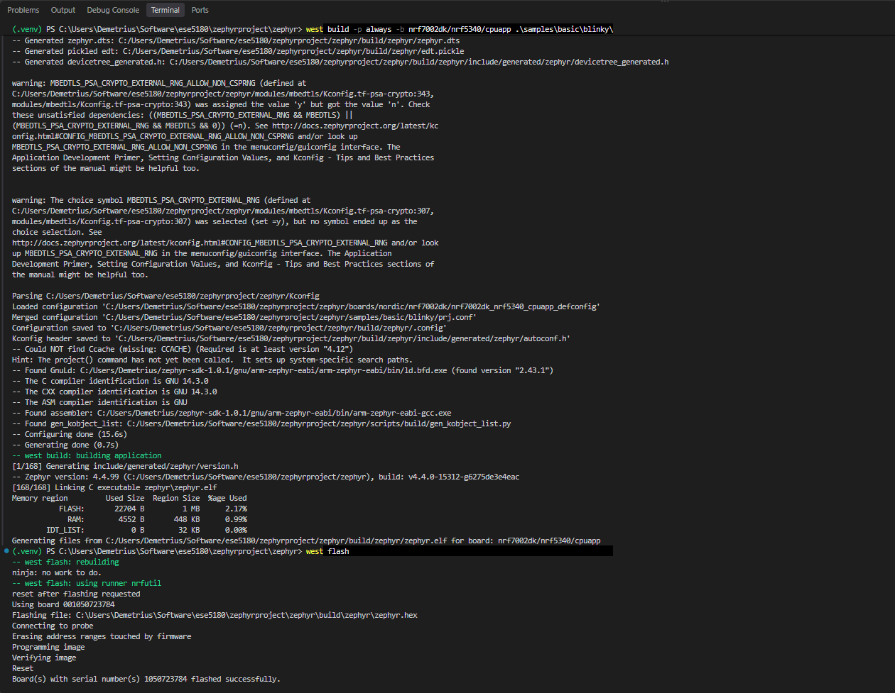
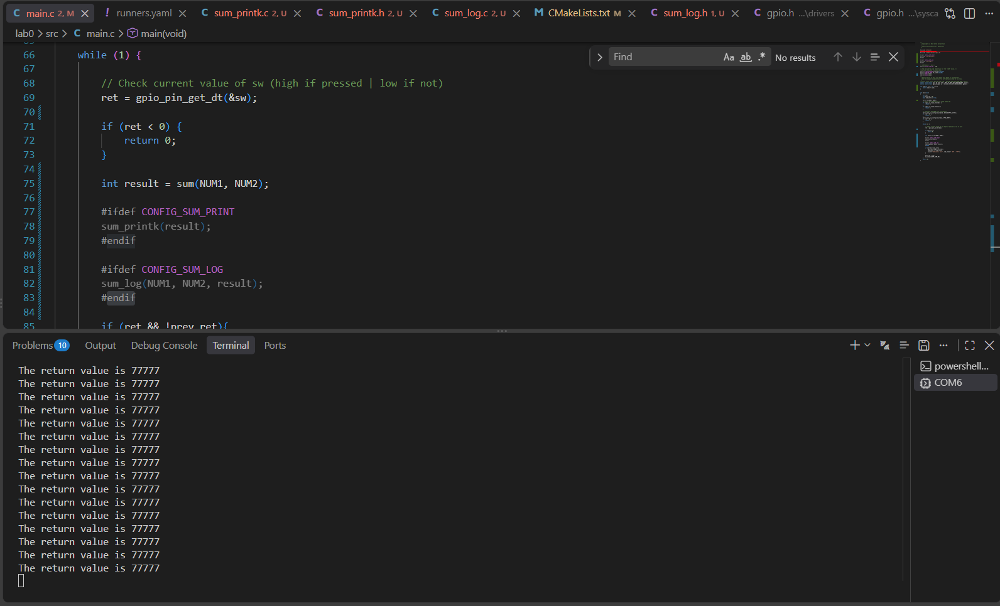
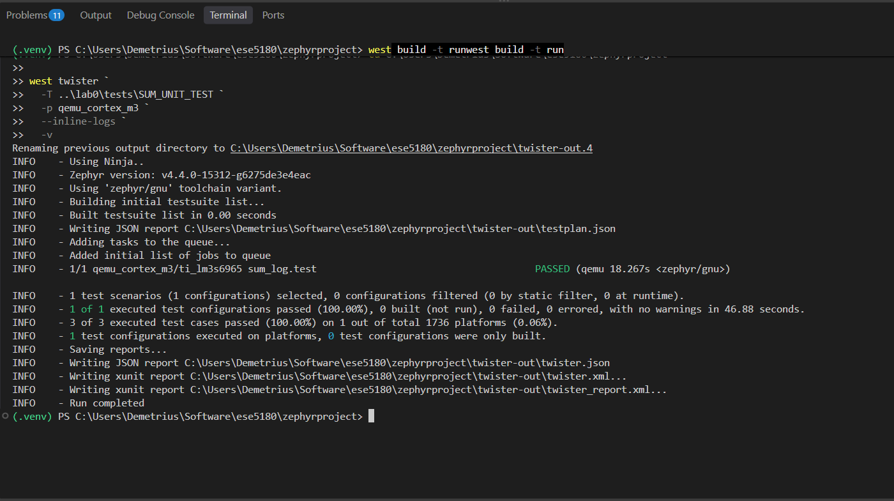
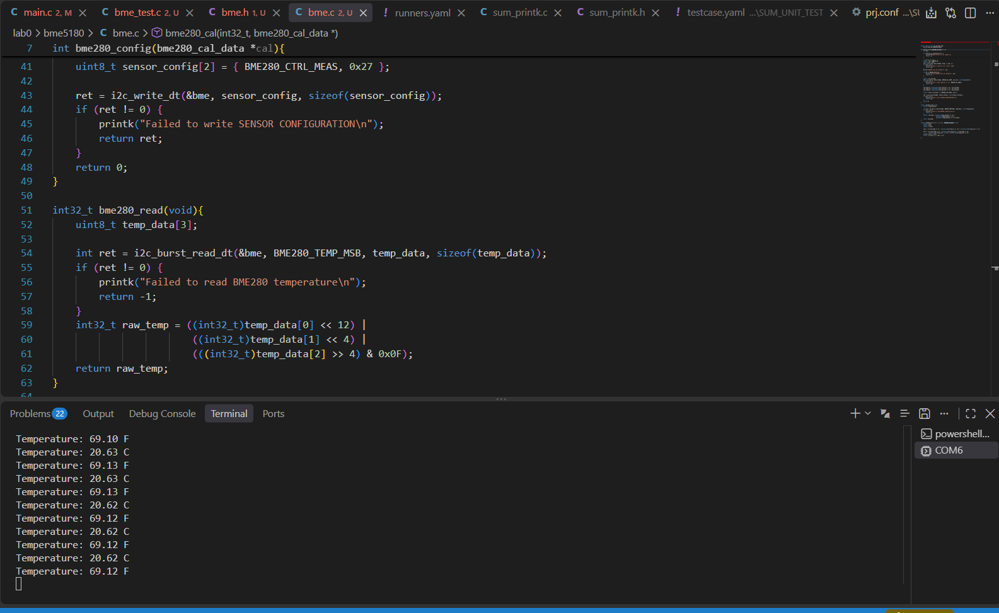
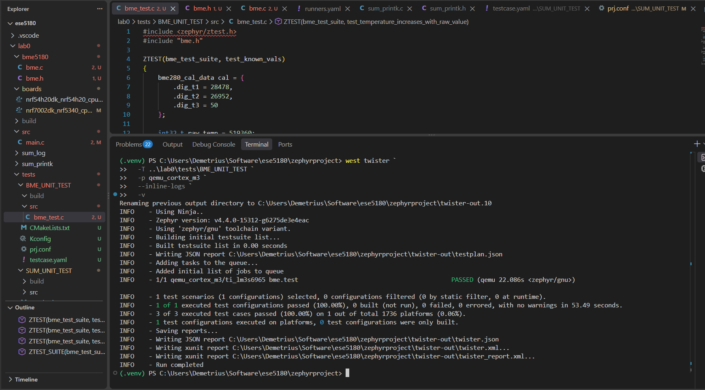

# ESE5180: Lab 0 Zephyr

| Team Member Name | Email Address       |
|------------------|---------------------|
| Demetrius Bosket | dbosket@engineering.upenn.edu           

**GitHub Repository URL:** 

## 3. Build and Flash using only west commands and not the GUI. Show the terminal prints by embedding a screenshot in your README.md.

## 6. Take screenshots of console output for both builds:
  
  
  
  
## 7. Take screenshots of the testing outputs (laptop) in the terminal.

## 8. Print out the temperature. Take screenshots of your logging output. Commit your Zephyr application to your GitHub repository.

## 8.2 Create a Ztest to test if the device tree is set up and run sanity checks. Take and embed screenshots of your Ztest output for your README.md. Commit your Zephyr application to your GitHub repository.

